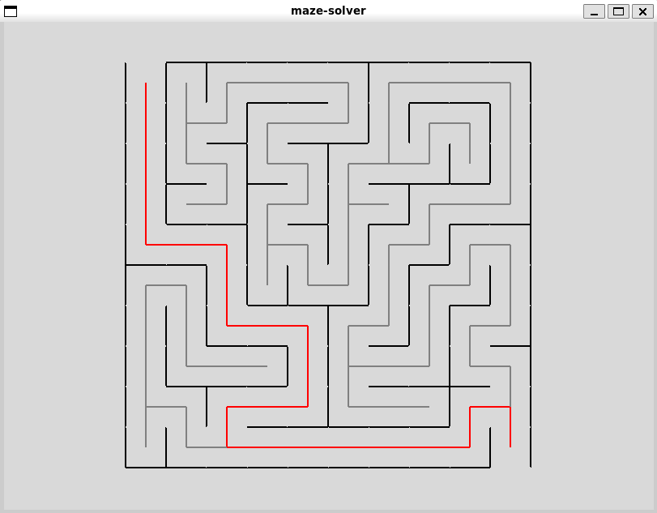

# maze-solver

This repository contains the code for my maze generator and solver. The code utilizes Tkinter as a GUI to create maze graphical elements and utilizes DFS to visually demonstrate the algorithm and solve the maze.

